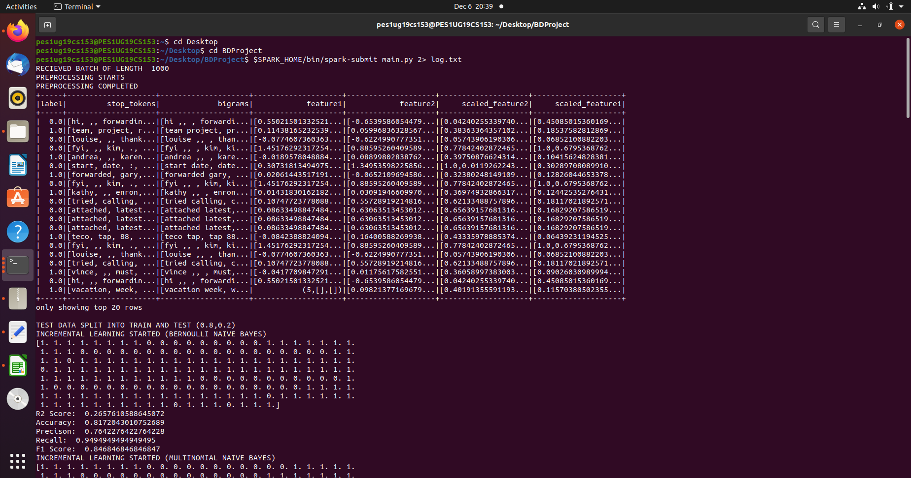
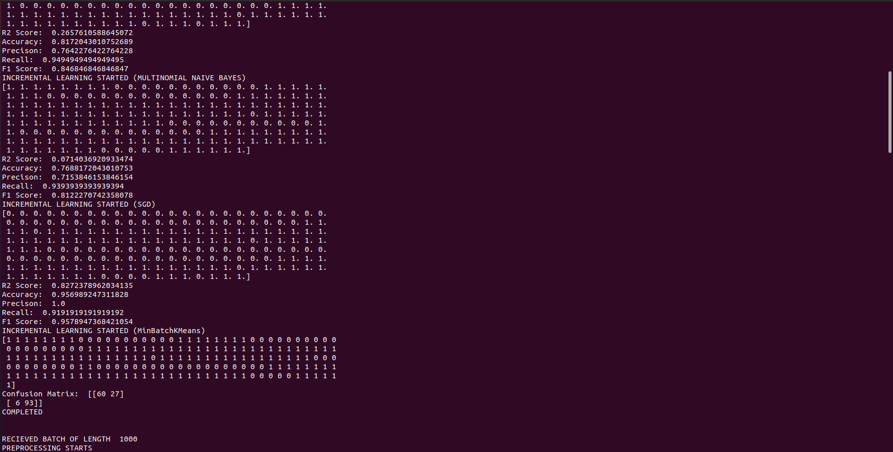

## Enron Email Spam Detection using PySpark
*Final Project carried out as part of the Big Data course (UE19CS322) at PES University.* \
### Commands to run: 
***Server:***
>***$ python3 stream.py -f spam -b batchsize*** \
*Spam is the folder containing train and test datasets.* 

***Client:***
>***$ $SPARK_HOME/bin/spark-submit spark.py 2> log.txt*** 
## Dataset:
- Each record consists of 3 features - the subject, the email content and the label. 
- Each email is one of 2 classes, spam or ham.
- 30k examples in train and 3k in test.
\
**Link:** [Spam](https://drive.google.com/drive/folders/1mMPa21_FInHVNOaG5irmve42Su6dI77K)

## Models Used:
1. Bernoulli NB *
2. Multinomial NB
3. PassiveAggressiveClassifier *
4. SGDClassifier *
5. MiniBatchKMeans *
-----
### Output Screenshots:

-----
